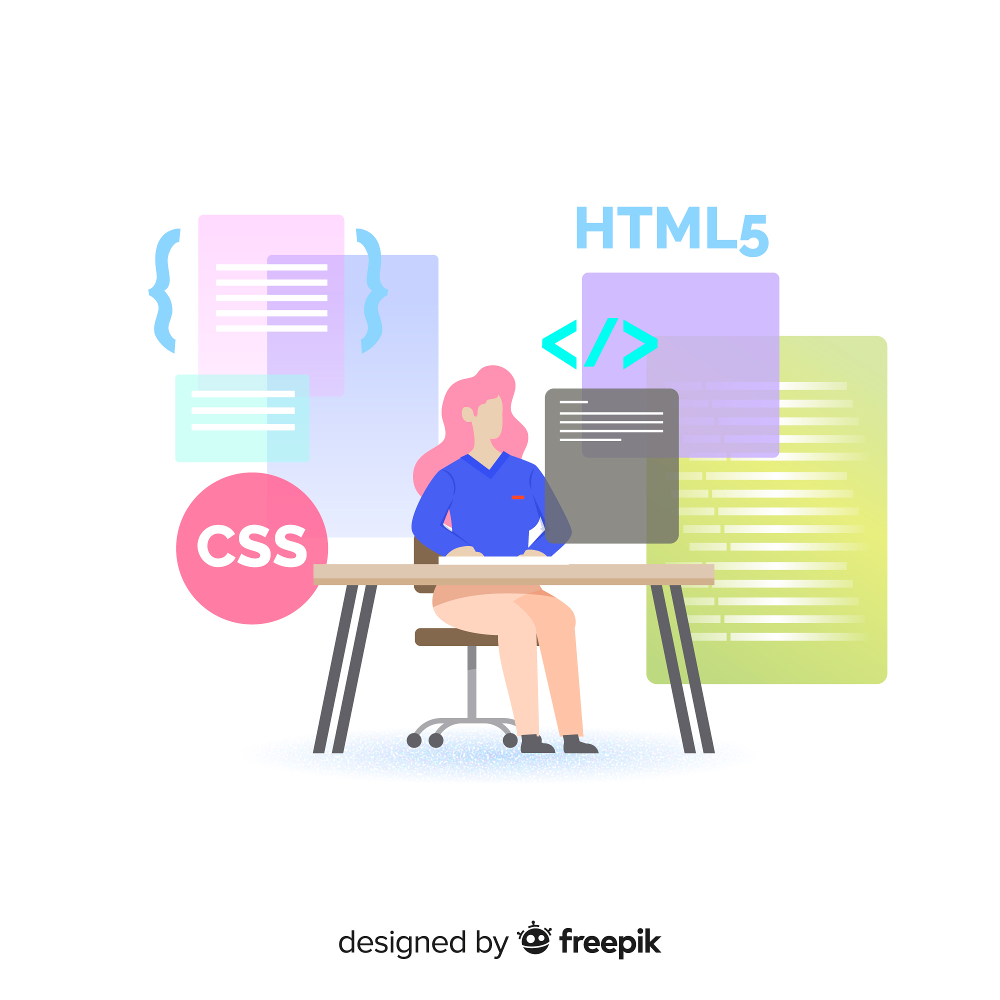

<h1>Hi There! 👋</h1>

## My name is Adriana Beatriz
(React JS | Javascript | HTML | CSS | Python | Django ) 🚀
- 👩‍💻 software development internship @[plugthink](https://plugthink.com/)
- 🎓 information systems Student @[ufrpe](https://www.ufrpe.br/)

  

  
 

